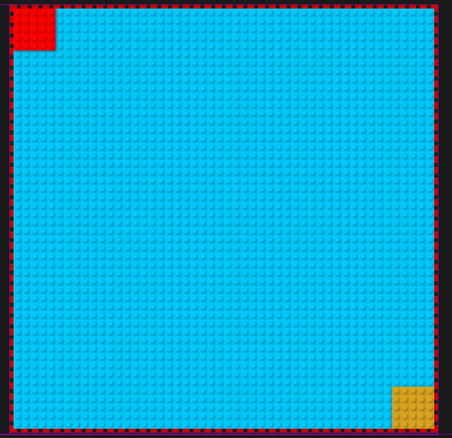

# 201FinalProject
## John Stratton, Ashley Biermann, Mason Fryberger

[*Click Here to Return to the HomePage*](index.html)

### Wireframe visualization for each page

[Home Page](img-assets/home-page-wireframe.PNG)

[About Us](img-assets/about-us-wireframe.PNG)

[Leaderboard](img-assets/leaderboard-wireframe.PNG)


## Synopsis

 Our goal for this project is to provide our users with an entertaining game utilizing `<canvas>` and JavaScript, that invokes a sense of nostalgia hailing back to classic games such as Dig Dug © and MineSweeper ©. Users will also have the option to read about us personally as developers and compare their game scores to a leaderboard. Other developers will have the option to look at our markdown documents and view our sources, references, and libraries. 

## Code Example



``` 
var legra = new legra(ctx, 10, {color: 'yellow'});
legra.ctx = ctx;
const unit = 5; // height and width of game "tile";

function playMat(){
  legra.rectangle(0, 0, (unit * 10), (unit * 10), {filled: true, color: '#00cbff'});

}

```

## Motivation

A short description of the motivation behind the creation and maintenance of the project. This should explain **why** the project exists.

## Installation

Provide code examples and explanations of how to get the project.

## API Reference

Depending on the size of the project, if it is small and simple enough the reference docs can be added to the README. For medium size to larger projects it is important to at least provide a link to where the API reference docs live.

## Tests

Describe and show how to run the tests with code examples.

## Contributors

Let people know how they can dive into the project, include important links to things like issue trackers, irc, twitter accounts if applicable.

## License

A short snippet describing the license (MIT, Apache, etc.)

